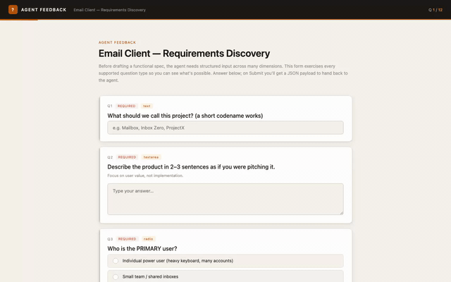
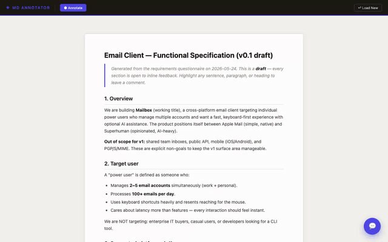

# agent-feedback

**A CLI tool for human-in-the-loop AI agent workflows.**

When an AI agent produces output — a document, a plan, a UI, a dataset — the human needs a way to respond with precise, structured feedback. Not a chat message. Not a vague thumbs up. **Real inline feedback that the agent can act on.**

`agent-feedback` compiles your content into self-contained HTML tools the human opens in a browser, annotates or answers, then copies a structured **free-text prompt** back to the agent. No server. No special tooling. No integrations to set up.

```
Agent produces output
  → agent-feedback compiles it into an HTML file
  → Human opens file, gives feedback
  → Human copies a prompt
  → Agent reads the prompt, continues
```

---

## See it in action

**End-to-end walkthrough** — from intent capture to mockup feedback, with narration:

<video src="https://github.com/nsharir/agent-feedback/raw/main/examples/demos/e2e-walkthrough.mp4" controls width="720"></video>

> _Video doesn't render on npm/some markdown viewers — [watch on GitHub](https://github.com/nsharir/agent-feedback/blob/main/examples/demos/e2e-walkthrough.mp4)._

A typical 3-stage agent loop: gather requirements → review the draft spec → critique the mockup.

### 1. Gather requirements with a questionnaire



### 2. Annotate the functional spec



### 3. Annotate the HTML mockup


---

## Install

```bash
npm install -g @nsharir/agent-feedback
```

Or run without installing:

```bash
npx @nsharir/agent-feedback compile input.json -o form.html
```

---

## Auto-wrap your agent's output (one command)

Once installed, hook `agent-feedback` into your agent harness so it **automatically wraps every `.md` / `.html` / `.json` file the agent produces** with the feedback framework — no manual `agent-feedback compile` calls needed.

```bash
npx @nsharir/agent-feedback install
```

The installer detects which agent harnesses are present and offers to patch their hook configs. It's idempotent and preserves any existing user config.

**Supported harnesses:**

| Harness | Hook event | Config location |
|---|---|---|
| **Claude Code** | `PostToolUse` | `.claude/settings.json` |
| **Cursor** (1.7+) | `afterFileEdit` | `.cursor/hooks.json` |
| **Codex** (CLI) | `PostToolUse` | `.codex/hooks.json` |
| **Hermes** (0.9+) | `post_tool_call` | `.hermes/plugins/` |

**Targeted installs:**

```bash
npx @nsharir/agent-feedback install --claude-code
npx @nsharir/agent-feedback install --cursor --global
npx @nsharir/agent-feedback install --codex
npx @nsharir/agent-feedback install --hermes
npx @nsharir/agent-feedback install --all              # every detected harness
```

**Verify what's installed:**

```bash
npx @nsharir/agent-feedback doctor
```

**Uninstall:**

```bash
npx @nsharir/agent-feedback uninstall --all
```

See [`plugins/<harness>/INSTALL.md`](plugins/) for per-harness details and manual install instructions.

---

## Three tools, one command

```
input file  +  embedded template  →  standalone HTML
```

| Input extension | Tool | What it produces |
|---|---|---|
| `.html` / `.htm` | **HTML Annotator** | Your page with click-to-annotate + text-selection UI |
| `.md` / `.markdown` | **Markdown Annotator** | Your markdown rendered as a preview with annotation controls |
| `.json` | **Agent Feedback** | A form the human fills in; structured answers copy to clipboard |

### `agent-feedback compile <input> -o <output>`

```bash
# Wrap a static HTML page with annotation controls
agent-feedback compile page.html -o page.annotated.html

# Bake a markdown file into a rendered, annotatable preview
agent-feedback compile docs.md -o docs-review.html

# Bake a questions JSON into an agent-feedback form
agent-feedback compile questions.json -o feedback.html
```

| Flag | Description |
|---|---|
| `-o, --out <file>` | Output file path (required) |
| `--tool <name>` | Override: `annotator` \| `md-annotator` \| `feedback` |
| `--force` | Overwrite output if it already exists |

### `agent-feedback info <file>`

Detect which tool would be used for a file without compiling.

---

## Why this exists

AI agents are increasingly capable of producing complex artifacts: HTML pages, markdown documents, multi-step plans, design specs. But the feedback loop is broken. Humans either:

- Type vague free-text responses ("looks good but fix the header")
- Screenshot and describe problems verbally
- Spend time re-explaining context the agent already has

`agent-feedback` closes this gap by turning agent output into an interactive feedback surface — with **no extra tooling required on either side**. The agent writes a file. The human opens it in a browser. The output is a structured payload the agent can parse.

---

## Tool details

### HTML Annotator

Inlines the annotation script into any static HTML page. The human opens it and annotates elements or text directly.

**Input:** any `.html` file
**Output:** same HTML with annotator injected before `</body>`

```bash
agent-feedback compile landing.html -o landing.annotated.html
```

**How the human annotates:**
- **Desktop:** hover to highlight elements, click to annotate; drag-select text for inline annotations
- **Mobile:** long-press (600ms) to annotate an element; native text selection + tap to annotate text

**Generated prompt** (copied to clipboard) references CSS selectors:
```
### Annotation #1 — Element
CSS Selector: section.hero > h2
Context: "Build faster, ship smarter"
Comment: Too vague — needs a concrete value prop
---
### Annotation #2 — Text Selection
Context: "trusted by over 12,000 teams"
Comment: Move this above the CTA button
```

### Markdown Annotator

Bakes a `.md` file into a self-contained HTML viewer. Annotations reference back to the **original markdown source with line numbers**.

**Input:** any `.md` / `.markdown` file
**Output:** `md-annotator.html` with markdown auto-loaded on open

```bash
agent-feedback compile docs/api.md -o review/api-review.html
```

Generated prompt format:
```
### Annotation #1 — Block Element
Line: L4
Markdown source reference:
```markdown
## Authentication
```
Comment: Add a curl example here
```

### Agent Feedback

Replaces the `QUESTIONS = null` placeholder with your JSON config. The output is a complete form the user fills in and submits — answers copy to clipboard as a structured natural-language prompt (see [Output prompt](#output-prompt) below).

**Input:** a `.json` file matching the schema below
**Output:** `feedback.html` with questions baked in

```bash
agent-feedback compile sprint-questions.json -o sprint-form.html
```

#### JSON schema

```json
{
  "title": "Session title",
  "description": "Context shown to the user",
  "questions": [
    {
      "id": "q1",
      "text": "Your question here?",
      "type": "text",
      "hint": "Optional helper text",
      "required": true
    }
  ]
}
```

#### Question types

| `type` | UI rendered | Extra fields |
|---|---|---|
| `text` | Single-line input | `placeholder` |
| `textarea` | Multi-line input | `placeholder` |
| `radio` | Pick one (option buttons) | `options: string[]` |
| `checkbox` | Pick many (checkboxes) | `options: string[]` |
| `select` | Dropdown | `options: string[]` |
| `boolean` | Yes / No buttons | — |
| `scale` | Discrete numbered buttons | `min`, `max`, `minLabel`, `maxLabel` |
| `range` | Continuous slider | `min`, `max`, `step`, `unit` |
| `date` | Date picker | — |

#### Modifiers

| Field | Description |
|---|---|
| `"other": true` | Adds an "Other…" option with a free-text input (`radio`, `checkbox`, `select`) |
| `"allowImage": true` | Adds an image upload zone below the question (any type) |
| `"required": true` | Submit stays disabled until this question is answered |

#### Output prompt

When the human submits, a structured **natural-language prompt** is copied to their clipboard. The format is identical across all three tools so the agent can parse it the same way every time:

```
The user completed a questionnaire and provided the following feedback.

Source: Session title
Total items: 2
Generated: 2026-05-24T10:00:00.000Z

---

## Item 1 — Your question?
Type: textarea
Comment: The user's answer

---

## Item 2 — Another question?
Type: radio
Comment: Option A

---

Please address each item above.
```

The leading sentence varies by tool (`completed a questionnaire`, `reviewed the document`, `reviewed a draft HTML page`) so the agent knows what kind of feedback it received. Item bodies always include the relevant context (line numbers for markdown, CSS selectors for HTML, question types for forms) followed by `Comment:` with the user's input.

---

## How the hooks work

A single shared Node.js script (`plugins/shared/post-write-hook.js`) handles all four harnesses. Each harness's config registers the same `agent-feedback __hook` command, which reads the harness-specific event JSON via stdin, normalizes it, and decides whether to wrap the written file.

The hook **never blocks the agent**. It runs after the write completes, wraps the file, and emits a non-blocking message telling the agent about the wrapped output. If anything fails, the agent continues with the raw file.

**File patterns the hook wraps:**
- `.md` / `.markdown` → `<name>.review.html` (markdown annotator)
- `.html` / `.htm` → `<name>.annotated.html` (HTML annotator)
- `.json` → `<name>.feedback.html` (feedback form)

**Skipped automatically:**
- Already-wrapped files (`.review.html`, `.annotated.html`, `.feedback.html`)
- Config files (`package.json`, `tsconfig.json`, `.eslintrc.json`, etc.)
- Files in `node_modules/`, `dist/`, `build/`, `.git/`

**Disable without uninstalling:**

```bash
export AGENT_FEEDBACK_DISABLED=1
```

**Disable auto-open (still compile, just don't launch the browser):**

```bash
export AGENT_FEEDBACK_AUTO_OPEN=0
```

Auto-open is automatically skipped in CI (`CI=1`) and on headless Linux (no `$DISPLAY` / `$WAYLAND_DISPLAY`).

**Quieter agent messages:**

```bash
export AGENT_FEEDBACK_VERBOSE=0
```

---

## Repo structure

```
src/
├── shared/                    ← single source of truth (DRY)
│   ├── tokens.css             ← shared design tokens
│   ├── preview-dialog.html    ← reusable dialog markup
│   ├── preview-dialog.css     ← dialog styles
│   ├── clipboard.js           ← 3-tier clipboard fallback
│   ├── preview.js             ← preview controller
│   ├── toast.js / toast.css   ← toast notifications
│   └── escape-html.js         ← shared util
│
├── tools/
│   ├── annotator/             ← HTML annotator script
│   ├── md-annotator/          ← Markdown annotator HTML template
│   └── feedback/              ← Feedback form HTML template
│
plugins/                       ← Agent harness integrations
├── shared/post-write-hook.js  ← Shared hook script (Node)
├── claude-code/               ← Claude Code config + INSTALL.md
├── cursor/                    ← Cursor config + INSTALL.md
├── codex/                     ← Codex config + INSTALL.md
└── hermes/                    ← Hermes Python plugin + INSTALL.md

build/build.js                 ← Resolves @include directives, writes templates
lib/templates/                 ← Built templates (committed)
lib/compiler.js                ← The compiler (consumes built templates)
lib/installer.js               ← Detects + patches harness configs
bin/cli.js                     ← CLI entry point
```

---

## Build process

Sources live in `src/`. To avoid duplication, files reference shared modules via `@include` directives:

```js
/* @include shared/clipboard.js */
```

```html
<!-- @include shared/preview-dialog.html -->
```

Run the build to resolve all includes and write the final templates to `lib/templates/`:

```bash
npm run build
```

The built templates are committed to git so `npm install` works without a build step. The `prepack` script automatically rebuilds before publishing.

### Adding to a shared module

1. Edit the file in `src/shared/`
2. Run `npm run build`
3. The change applies to every tool that includes it
4. Commit both `src/` and `lib/templates/`

### Adding a new tool

1. Create `src/tools/<name>/` with HTML template + tool-specific CSS/JS
2. Use `@include` to pull in shared modules
3. Add an entry to `build/build.js`'s `targets` array
4. Add a case to `lib/compiler.js`'s `compile()` switch
5. Add file-extension detection to `detectTool()` in `lib/compiler.js`

---

## Agent workflow patterns

### HTML review loop

```
1. Agent generates or modifies an HTML page
2. Agent: agent-feedback compile page.html -o page.review.html
3. Agent asks human: "Open page.review.html, annotate anything
   that needs changing, then copy the prompt and paste it back."
4. Human annotates → copies prompt
5. Agent reads prompt, makes targeted edits
6. Loop repeats until approved
```

### Document review loop

```
1. Agent writes a markdown document
2. Agent: agent-feedback compile doc.md -o doc.review.html
3. Human opens file, annotates sections by line number
4. Agent receives prompt with line-referenced comments
5. Agent edits the specific lines and recompiles
```

### Structured intake / clarification

```
1. Agent needs information before proceeding
2. Agent writes questions.json targeting exactly what it needs
3. Agent: agent-feedback compile questions.json -o intake.html
4. Human fills in the form, copies the prompt
5. Agent reads the structured prompt, extracts answers
6. Agent continues with full context — no back-and-forth
```

---

## Clipboard behavior

The framework uses a 3-tier clipboard strategy that gracefully degrades:

1. **`navigator.clipboard.writeText`** — modern API (https / localhost only)
2. **`document.execCommand('copy')`** — older fallback for some `file://` contexts
3. **Manual selection** — auto-selects the preview textarea and shows a hint like *"Press ⌘ + C to copy manually"*

This means the tools work even when opened directly via `file://` — the user just hits one keystroke to finish.

---

## Compiled file identification

Every output file starts with an HTML comment identifying it:

```html
<!-- compiled by @nsharir/agent-feedback | tool: feedback | source: questions.json -->
```

Agents can read the first line of any output file to verify what they're presenting to a user.

---

## Examples

See [`examples/`](examples/) for ready-to-compile inputs.

```bash
npm run compile:examples
```

This will compile every file in `examples/` into `examples/built/`.

---

## License

[MIT](LICENSE)
